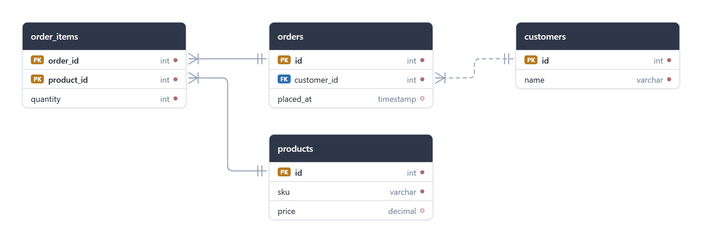

<h1 align="center">dbml-erd-viewer</h1>

<p align="center">
  Render a <a href="https://dbml.dbdiagram.io/">DBML</a> database schema as an interactive ERD —
  a React component built on <a href="https://reactflow.dev">@xyflow/react</a> (React Flow).
</p>

<p align="center">
  <a href="https://www.npmjs.com/package/dbml-erd-viewer"></a>
  
  
  <a href="https://usingsky.github.io/dbml-erd-viewer/"></a>
</p>

<p align="center">
  
</p>

<p align="center"><strong><a href="https://usingsky.github.io/dbml-erd-viewer/">▶ Try the live playground</a></strong> — tweak every prop interactively.</p>

## Features

- **DBML in, diagram out** — parses schemas with [`@dbml/core`](https://github.com/holistics/dbml); tables become draggable nodes with PK/FK badges, types, notes, and a nullability dot (filled = `not null`, hollow = nullable).
- **Crow's-foot notation** — MySQL-Workbench-style edges: identifying (solid) vs non-identifying (dashed), cardinality, and optionality, all inferred from the DBML.
- **Pluggable layout** — zero-dependency built-in layout, or opt into [`dagre`](https://github.com/dagrejs/dagre) / [`elkjs`](https://github.com/kieler/elkjs) for crossing minimization.
- **Themeable** — light/dark presets plus per-token CSS variables and custom fonts.
- **Interactive** — drag tables, persist positions, hover to highlight related columns, one-click auto-layout.
- **Export** — save the diagram as PNG or SVG.
- **Typed & dual-format** — ships TypeScript types, ESM + UMD.

## Install

```bash
npm install dbml-erd-viewer @xyflow/react @dbml/core react react-dom
```

`react`, `react-dom`, `@xyflow/react`, and `@dbml/core` are treated as external — install them
alongside the library (they are listed as dependencies, so a default install pulls them in).

## Usage

```tsx
import { DbmlViewer } from 'dbml-erd-viewer';
import 'dbml-erd-viewer/styles.css'; // bundles the required React Flow base styles

const dbml = `
Table users {
  id int [pk, increment]
  username varchar [not null, unique]
}

Table posts {
  id int [pk]
  user_id int [ref: > users.id]
  title varchar
}
`;

export default function App() {
  return (
    <div style={{ width: '100%', height: 600 }}>
      <DbmlViewer dbml={dbml} showMiniMap />
    </div>
  );
}
```

> The viewer fills its parent, so give the wrapping element an explicit height.

## Relationship notation

Edges follow MySQL Workbench's EER diagram (crow's-foot) notation:

| Visual                         | Meaning                                                            |
| ------------------------------ | ----------------------------------------------------------------- |
| **Solid line**                 | Identifying relationship — the FK is part of the child's primary key |
| **Dashed line**                | Non-identifying relationship — the FK is not part of the primary key |
| Crow's foot (`<`)              | "Many" side (the child table that holds the foreign key)          |
| Double bar (`‖`)               | "One and only one" — a `not null` foreign key                     |
| Bar + ring (`⊣O`)              | "Zero or one" — a nullable foreign key                            |

These are derived automatically from the DBML: cardinality from the `>`/`-`/`<` ref operator,
identifying vs non-identifying from primary-key membership (including composite `[pk]` indexes),
and the "one" side's optionality from the foreign-key column's nullability. The "many" (crow's-foot)
side carries a cardinality bar (Workbench style) by default — whether a parent may have zero children
isn't expressible in standard DBML.

**Optional collection (opt-in):** if the foreign-key column's `note` contains the word `optional`,
the crow's-foot side is drawn with a ring instead of the bar ("zero or many"):

```dbml
Table line_items {
  order_id int [not null, ref: > orders.id]            // crow's foot + bar
  promo_id int [ref: > promos.id, note: 'optional']    // crow's foot + ring (zero or many)
}
```

## `<DbmlViewer>` props

| Prop             | Type                          | Default | Description                                    |
| ---------------- | ----------------------------- | ------- | ---------------------------------------------- |
| `dbml`           | `string`                      | —       | DBML source text to render (required).         |
| `fitView`        | `boolean`                     | `true`  | Fit the diagram into view on load.             |
| `showControls`   | `boolean`                     | `true`  | Show the zoom/pan controls.                    |
| `showMiniMap`    | `boolean`                     | `false` | Show the minimap.                              |
| `showBackground` | `boolean`                     | `true`  | Show the dotted background grid.               |
| `layoutOptions`  | `LayoutOptions`               | —       | Algorithm, direction, and node spacing (see below). |
| `onParseError`   | `(error: DbmlParseError) => void` | —   | Called when the DBML fails to parse.           |
| `onLayoutError`  | `(error: LayoutError) => void` | —      | Called when a `dagre`/`elk` layout fails (e.g. missing optional dep). |
| `nodePositions`  | `NodePositions`               | —       | Saved table positions (`id → {x,y}`) to restore. See [Persisting positions](#persisting-node-positions). |
| `onNodePositionsChange` | `(positions: NodePositions) => void` | — | Called after a table drag with the full positions map to persist. |
| `className`      | `string`                      | —       | Class applied to the wrapper element.          |
| `style`          | `CSSProperties`               | —       | Inline style for the wrapper element.          |

If the DBML is invalid, the viewer renders the parser errors inline (one line per problem, with
`Line:column — message`) and, if provided, calls `onParseError`. The `DbmlParseError` also exposes a
structured `diagnostics: DbmlDiagnostic[]` array (`{ message, line?, column?, code? }`) if you want to
render errors your own way:

```tsx
<DbmlViewer
  dbml={dbml}
  onParseError={(err) => err.diagnostics.forEach((d) => console.log(d.line, d.message))}
/>
```

## Layout

`layoutOptions.algorithm` selects how tables are positioned:

| Algorithm  | Dependency        | Notes                                                                 |
| ---------- | ----------------- | --------------------------------------------------------------------- |
| `'simple'` | none (default)    | Built-in left-to-right layering. Zero dependencies, synchronous.      |
| `'dagre'`  | `@dagrejs/dagre`  | Sugiyama layered layout with crossing minimization.                   |
| `'elk'`    | `elkjs`           | ELK `layered` algorithm; strongest crossing reduction for dense schemas. |

`dagre` and `elk` are **optional peer dependencies**, loaded on demand only when selected — they are
not in the default bundle. Install whichever you use:

```bash
npm install @dagrejs/dagre   # for algorithm: 'dagre'
npm install elkjs            # for algorithm: 'elk'
```

```tsx
<DbmlViewer
  dbml={dbml}
  layoutOptions={{ algorithm: 'elk', direction: 'LR', horizontalGap: 120, verticalGap: 40 }}
  onLayoutError={(e) => console.error(e.message)}
/>
```

If a `dagre`/`elk` layout throws (e.g. the dependency isn't installed), the viewer falls back to the
built-in `simple` layout and calls `onLayoutError`. `direction` is `'LR'` (left→right) or `'TB'`
(top→bottom).

### Node width

Table nodes are sized to their content (the widest column row and the header), clamped between
`minNodeWidth` and `maxNodeWidth`. Content wider than `maxNodeWidth` is truncated with an ellipsis
(the full text stays in the element's `title`). Both are part of `layoutOptions`:

| Option         | Default | Notes                                                              |
| -------------- | ------- | ------------------------------------------------------------------ |
| `minNodeWidth` | `160`   | Lower bound for a node's width, in px.                             |
| `maxNodeWidth` | `320`   | Upper bound; longer column names/types ellipsize at this width.    |

```tsx
<DbmlViewer dbml={dbml} layoutOptions={{ minNodeWidth: 200, maxNodeWidth: 480 }} />
```

## Persisting node positions

Tables are draggable. To keep where the user moved them, store the positions yourself and pass
them back via `nodePositions`. The library is storage-agnostic — `onNodePositionsChange` fires after
each drag with the full `id → {x, y}` map:

```tsx
const KEY = 'erd-positions';
const [positions, setPositions] = useState<NodePositions>(
  () => JSON.parse(localStorage.getItem(KEY) ?? '{}'),
);

const save = (next: NodePositions) => {
  setPositions(next);
  localStorage.setItem(KEY, JSON.stringify(next));
};

<DbmlViewer dbml={dbml} nodePositions={positions} onNodePositionsChange={save} />;
```

`nodePositions` is applied when the schema/layout (re)builds: a saved position wins, and tables
without one fall back to auto-layout (so newly added tables still get placed). To reset to a fresh
auto-layout, pass `{}` / `undefined`. The same precedence applies when switching layout algorithm —
clear the saved map if you want the new algorithm to reposition everything.

### Stable positions while editing

The viewer only re-runs auto-layout when the **set of tables** or the **layout options** change.
Editing column-level details (columns, types, notes) — or even relations — between the existing
tables keeps every node where it is and just refreshes the contents and edges. Adding a table keeps
the existing tables in place and only positions the new one; changing the layout algorithm/direction
reshuffles everything. This holds whether or not you use `nodePositions`, so manual drags survive
ordinary edits.

To deliberately re-arrange everything, the control panel (when `showControls` is on) has an
**Auto layout** button (hierarchy icon). Clicking it re-runs the current layout algorithm on all
tables, fits the view, and — if you use `nodePositions` — emits the new arrangement via
`onNodePositionsChange` so it persists.

## Exporting to PNG / SVG

Pass a `ref` to get a `DbmlViewerHandle` and export the full diagram (all tables, framed at
100%) as an image. This uses the optional `html-to-image` dependency, loaded on demand:

```bash
npm install html-to-image
```

```tsx
import { useRef } from 'react';
import { DbmlViewer, type DbmlViewerHandle } from 'dbml-erd-viewer';

function App() {
  const viewer = useRef<DbmlViewerHandle>(null);
  return (
    <>
      <button onClick={() => viewer.current?.download('schema.png', { type: 'png' })}>
        Export PNG
      </button>
      <DbmlViewer ref={viewer} dbml={dbml} />
    </>
  );
}
```

`DbmlViewerHandle`:

| Method                                                  | Description                                        |
| ------------------------------------------------------- | -------------------------------------------------- |
| `download(filename, options?)`                          | Render the diagram and trigger a browser download. |
| `toDataUrl(options?)` → `Promise<string>`               | Return the image as a data URL.                    |

`DiagramExportOptions`: `type` (`'png'` \| `'svg'`, default `'png'`), `padding` (default `24`),
`backgroundColor` (defaults to the viewer's canvas color), `pixelRatio` (PNG sharpness, default `2`).
The export reflects the current theme. If `html-to-image` isn't installed, the methods reject with an
`ExportError`.

## Lower-level API

The parsing and layout helpers are exported for building custom renderers:

```ts
import { parseDbml, layoutSchema } from 'dbml-erd-viewer';

const schema = parseDbml(dbml);     // { tables, relations }
const boxes = layoutSchema(schema); // Map<tableId, { x, y, width, height }>
```

See `src/types.ts` for the full `ParsedSchema`, `TableInfo`, `ColumnInfo`, and `RelationInfo` shapes.

## Theming

There are three ways to customize the look, from most to least convenient:

**1. The `theme` prop** — pass a (partial) `DbmlViewerTheme`; each token maps to a CSS variable and
only the keys you set are overridden. The `darkTheme` and `lightTheme` presets are exported:

```tsx
import { DbmlViewer, darkTheme, type DbmlViewerTheme } from 'dbml-erd-viewer';

// Use a preset directly…
<DbmlViewer dbml={dbml} theme={darkTheme} />;

// …or spread a preset and tweak, or pass your own partial theme:
const custom: DbmlViewerTheme = { ...darkTheme, headerBackground: '#4f46e5', edge: '#818cf8' };
<DbmlViewer dbml={dbml} theme={custom} />;
```

Available tokens: `canvas`, `background`, `border`, `headerBackground`, `headerForeground`,
`rowForeground`, `typeForeground`, `rowHover`, `rowHighlight`, `primaryKey`, `foreignKey`, `edge`,
`edgeActive`, `fontFamily`.

**2. CSS custom properties** — the same variables, scoped to `.dv-viewer`, set in your own
stylesheet for an app-wide default:

```css
.dv-viewer {
  --dv-header-bg: #1e3a8a;
  --dv-edge: #1e3a8a;
  --dv-pk: #b7791f;
  --dv-fk: #2b6cb0;
}
```

**3. Class hooks** — for anything beyond colors/fonts, target the structural classes directly:
`.dv-table`, `.dv-table__header`, `.dv-row`, `.dv-row--highlighted`, `.dv-badge--pk`,
`.dv-badge--fk`, `.dv-erd-edge__path`, `.dv-erd-marker`. You can also pass `className`/`style` to
the wrapper.

> All bundled styles live in the `dbml-erd-viewer` [cascade layer](https://developer.mozilla.org/en-US/docs/Web/CSS/@layer).
> Because unlayered styles always beat layered ones, your own CSS (options 2 and 3) overrides the
> defaults regardless of import order or selector specificity — no `!important` required.

## Fonts

The table text uses the `fontFamily` theme token (CSS variable `--dv-font`), which defaults to the
system UI font stack. To use your own font, set it via the `theme` prop or the CSS variable:

```tsx
<DbmlViewer dbml={dbml} theme={{ fontFamily: '"Inter", sans-serif' }} />
```

```css
/* app-wide, in your own stylesheet */
.dv-viewer { --dv-font: "Inter", sans-serif; }
```

The library does **not** bundle any fonts — load the font yourself (the same way you load fonts for
the rest of your app), then reference it by name:

```html
<link rel="stylesheet" href="https://fonts.googleapis.com/css2?family=Inter&display=swap" />
```

```css
/* or self-hosted */
@font-face { font-family: "Inter"; src: url("/fonts/Inter.woff2") format("woff2"); }
```

**Image export:** PNG/SVG export inlines the rendered text, so a custom font must be **loaded before
export** or the image falls back to a default font. The viewer waits for `document.fonts.ready`
before capturing, which covers fonts already requested by the page; if you load a font only for the
diagram, trigger it first (e.g. `await document.fonts.load('16px "Inter"')`) before calling
`download()` / `toDataUrl()`.

## Acknowledgements

This library is built on top of two excellent projects:

- [**@dbml/core**](https://github.com/holistics/dbml) ([npm](https://www.npmjs.com/package/@dbml/core), [docs](https://dbml.dbdiagram.io/)) — the official DBML parser, used to parse the schema into tables and relations.
- [**@xyflow/react**](https://github.com/xyflow/xyflow) ([npm](https://www.npmjs.com/package/@xyflow/react), [docs](https://reactflow.dev)) — React Flow, used to render the interactive node-and-edge diagram.

Many thanks to their maintainers and contributors.

## License

MIT
